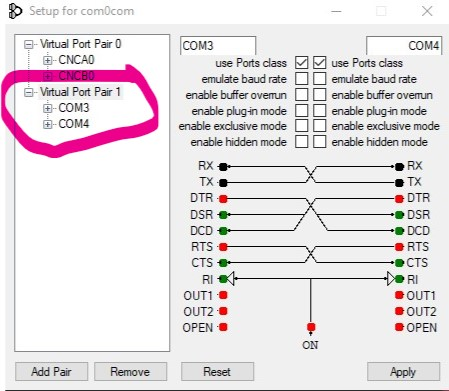
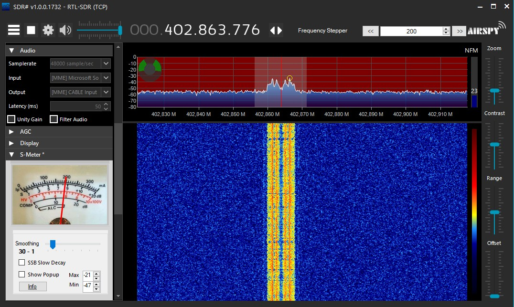
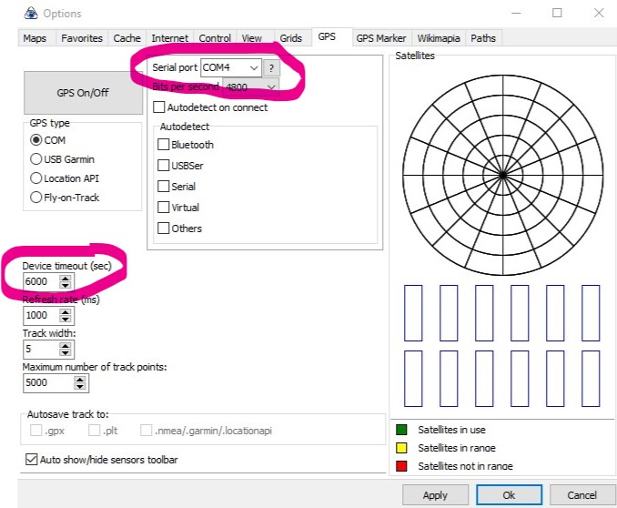

<!DOCTYPE html>
<html class="no-js" lang="en">
  <head>
  </head>
  <body>
    

      
 
        

          <h1>RS-Decoder
                for Radiosonde's in Windows. </h1>
          

          
  
          

           
          
A radiosonde is a
            small weather sensor package that is typically attached to a
            weather balloon.  
            As it rises into the atmosphere it measures parameters such
            as temperature, humidity, pressure, GPS location etc, and
            transmits this data back down to a receiver base station
            using a radio signal. 
            Zilog's RS-Decoders
            is a free open source radiosonde decoder for
            Windows/Linux and it supports a wide range of radiosonde
            protocols.  
            Together with an RTL-SDR it is possible to receive
            radiosonde signals, and decode them using RS-Decoders.

          
This tutorial
            covers some tricky points like setting up Virtual audio
            piping in Windows, and getting the GPS data to route with
            perl to into virtual COM port to use with GPS programs. 
            In this example Windows 10 1909 in VirtualBox is used with
            GPS-Mouse, RTL-SDR V3 / Airspy R2 SDR radio, SDR#,
            SDRConsole and APRS-Map Software. 
            Install x32 Software version´s for 32 Bit Windows (XP/7 ect)
            and offcourse x64 for 64 Bit Windows. 
          

          
A new develop
            branch is active 'experimental' demodulation chains, which
            use David Rowe's FSK Demodulator to enable better tracking
            of drifty sondes.  
            It is expected that the new experimental demod chain will
            have a slightly higher CPU usage than the legacy chains,  
            though the exact impact is minimal. 
             
            These demodulators are intended for use in situations where
            radiosonde frequency drift is encountered, E.g. DFM's.  
             
            Refer to these tech-note's for details: 
             
            <a
href="https://github.com/projecthorus/radiosonde_auto_rx/blob/master/auto_rx/test/notes/2019-04-26_fsk_demod.md"
              target="_blank">https://github.com/projecthorus/radiosonde_auto_rx/blob/master/auto_rx/test/notes/2019-04-26_fsk_demod.md</a> 
            <a
href="https://github.com/projecthorus/radiosonde_auto_rx/blob/master/auto_rx/test/notes/2019-04-23_rs41_highpass.md"
              target="_blank">https://github.com/projecthorus/radiosonde_auto_rx/blob/master/auto_rx/test/notes/2019-04-23_rs41_highpass.md</a> 
             
          

          

            
Contents:

            <ul>
              <li> Overview
                <ul>
                  <li>1.1&nbsp; <a href="#Compile_Decoders_">Compile
                        Decoders</a> </li>
                  <li>1.2&nbsp; <a href="#Decoder_Scripts_">Decoder
                        Script's</a> </li>
                  <li>1.3&nbsp; <a href="#Setting_up_Virtual_">Setup
                        Virtual Audio/COM Ports</a> 
                    </li>
                  <li>1.4&nbsp;  <a href="#SDR_Radio_programs_">SDR
                      Radio Programs</a></li>
                  <li>1.5&nbsp; <a href="#GPS_Setup_">GPS Setup</a>
                  </li>
                  <li>1.6&nbsp; <a
                        href="#Get_it_all_Running_">Get it all running</a>
                      </a> </li>
                  <li>1.7&nbsp; <a 
				        href="#APRS-Map_">APRS-Map</a></li>
                  <li>1.8&nbsp; <a href="#ADB_Android_USB_GPS">ADB
                      Android USB GPS</a>
                  <li>1.9&nbsp; <a href="#Android_WiFi_GPS">Android
                      WiFi GPS</a> 
                  </li>
                  <li>2.0&nbsp; <a
                      href="https://github.com/happysat/Windows-Subsystem-for-Linux-WSL-and-SDR-in-Windows-10"
                      target="_blank">WSL and SDR</a> 
                  </li>
		  <li>2.1&nbsp; <a
                      href="https://github.com/happysat/Windows-Subsystem-for-Android-WSA-and-SDR"
                      target="_blank">WSA and SDR</a> 
                  </li>
                </ul>
          

          
 

          <h2>Compile
            Decoders&nbsp;&nbsp;  
          </h2>
           
          <a href="/RS.zip?raw=true">Download Decoders and Script</a> 
           
          <a href="https://github.com/happysat/RS-Binaries/tree/main/Windows" target="_blank">Updated
            compiled RS-Decoders are overhere.</a> 
           
          <b>Unzip rs.zip and move to C:</b> 
           
          <b>Note:</b> 
           
          All scripts are having output to com3 (pos2nmea.pl 2&gt;COM3)
          <b>&lt;&lt;-- change this if you have another port number!</b> 
          <b>Audio device is named "CABLE Output" in all script's!</b> 
           
          <b>When compiling also put pos2nmea.pl (NMEA perl script) in
            the decoder folder!</b> 
          The perl script from GIT in folder RS/tools is only for Linux
          Usage. 
          <b>Use the one above linked in rs.zip adapted for Windows
            NMEA!</b> 
           
          
 <a href="#Setting_up_Virtual_">And skip this part.</a>

           
          Or create manually, RS-Decoders can be compiled with <a
            href="https://cygwin.com/install.html" target="_blank">cygwin</a>. 
           
          
<b>Download the
              decoders source files, </b>

          
<a
              href="https://github.com/rs1729/RS/archive/master.zip"
              target="_blank">https://github.com/rs1729/RS/archive/master.zip</a>

          <b>Unzip:</b> 
          cd build/demod/mod 
          gcc -c demod_mod.c -w -O3 
          gcc -DCYGWIN -c bch_ecc_mod.c -w -O3 
           
          <b>For RS-41</b>: 
          gcc -DCYGWIN rs41mod.c demod_mod.o bch_ecc_mod.o -lm -O3 -o
          rs41mod -w 
           
          <b>DFM:</b> 
          gcc -DCYGWIN dfm09mod.c demod_mod.o -lm -O3 -o dfm09mod -w 
           
          <b>M10, 20:</b> 
           
          gcc -DCYGWIN m10mod.c demod_mod.o -lm -O3 -o m10mod -w 
           
          gcc -DCYGWIN mXXmod.c demod_mod.o -lm -O3 -o mXXmod -w 
           
          <h2>Decoder Scripts 
          </h2>
          
 <b>Example&nbsp;
              DFM09 Script:</b> 
          

          
Create new file
            dfm09.bat with content:

          @echo off 
          SET sox_path="C:\Program Files (x86)\sox-14-4-2\" 
          SET tail_path="C:\RS\decoders\" 
          SET perl_path="C:\Strawberry\perl\bin\" 
          SET dfm_path="C:\RS\decoders\" 
          %sox_path%sox.exe -q -t waveaudio "CABLE Output" -t wav -
          2&gt;nul | %dfm_path%dfm09mod.exe --dist --ptu -vv --auto
          &gt;&gt;
          C:\RS\log\dfm09_%date:~-4,4%%date:~-7,2%%date:~-10,2%.txt |
          %tail_path%tail.exe -f
          C:\RS\log\dfm09_%date:~-4,4%%date:~-7,2%%date:~-10,2%.txt |
          %perl_path%perl.exe pos2nmea.pl 2&gt;COM3 
          
<b>Save it</b>. 
             
          

          
<b>Example RS-41
              Script:</b> 
          

          
Create new file
            rs41.bat with content: 

          @echo off 
          SET sox_path="C:\Program Files (x86)\sox-14-4-2\" 
          SET tail_path="C:\RS\decoders\" 
          SET perl_path="C:\Strawberry\perl\bin\" 
          SET rs41_path="C:\RS\decoders\" 
          %sox_path%sox.exe -q -t waveaudio "CABLE Output" -t wav -
          2&gt;nul | %rs41_path%rs41mod.exe --ecc2 --crc -vx --ptu
          &gt;&gt;
          C:\RS\log\rs41_%date:~-4,4%%date:~-7,2%%date:~-10,2%.txt |
          %tail_path%tail.exe -f
          C:\RS\log\rs41_%date:~-4,4%%date:~-7,2%%date:~-10,2%.txt |
          %perl_path%perl.exe pos2nmea.pl 2&gt;COM3 
          <b>Save it</b>. 
           
          <b>What does it
              all mean.</b> 
             
            <b>rs41mod -h</b> 
            rs41mod [options] audio.wav 
            options: 
            &nbsp;-v, -vx, -vv&nbsp; (info, aux, info/conf) 
            &nbsp;-r, --raw 
            &nbsp;-i, --invert 
            &nbsp;--ths &lt;x&gt;&nbsp;&nbsp;&nbsp; (peak threshold;
            default=0.7) 
            &nbsp;--iq0,2,3&nbsp;&nbsp;&nbsp; (IQ data) 
             
            <b>dfm09mod -h</b> 
            dfm09mod [options] audio.wav 
            options: 
            &nbsp;-v, -vv 
            &nbsp;-r, --raw 
            &nbsp;-i, --invert 
            &nbsp;--ecc&nbsp;&nbsp;&nbsp;&nbsp;&nbsp;&nbsp;&nbsp;
            (Hamming ECC) 
            &nbsp;--ths &lt;x&gt;&nbsp;&nbsp;&nbsp; (peak threshold;
            default=0.6) 
            &nbsp;--json&nbsp;&nbsp;&nbsp;&nbsp;&nbsp;&nbsp; (JSON
            output) 
            &nbsp;--ecc2 now also gives the output after each block how
            many bits the error correction has corrected.  
            &nbsp;--ptu temperature Info 
            &nbsp;--dist is like ecc, but only blocks that belong to the
            same frame are taken, i. if errors occur, the frame is
            discarded / Inversed used for DFM06/90 
           
          <h2>Setting up Virtual
            Audio/COM ports&nbsp;&nbsp;&nbsp;&nbsp;&nbsp;&nbsp;&nbsp;  
          </h2>
           
          <a href="https://sourceforge.net/projects/sox/"
            target="_blank">Download the windows version of sox and
            install.</a> 
           
          <a
            href="https://www.vb-audio.com/Cable/index.htm#DownloadCable"
            target="_blank">Download Virtual Audio Cable and install.</a> 
           
          <b>Open VB-Audio Control Panel in options change Internal
            Sampling rate to 48000 Hz and reboot.</b> 
           
          <a
            href="https://sourceforge.net/projects/com0com/files/com0com/3.0.0.0/"
            target="_blank">Download Com0Com x64 Program.</a> 
           
          <b>Install:</b> 
           
           
           
          Make sure you have a virtual com port, otherwise change the
          number. 
          All scripts are having output to com3 (pos2nmea.pl 2&gt;COM3)
          <b>&lt;&lt;-- change this if you have another port number!</b> 
           
           
           
          If everything is okay you have <b>2 new virtual COM ports</b>
          in Windows Control Panel. 
           
           
           
          <b>Download Perl x64 and install:</b> 
           
          <a href="http://strawberryperl.com/releases.html"
            target="_blank">http://strawberryperl.com/releases.html</a> 
           
          Needed for NMEA Perl Script for GPS Output.  
          <h2>SDR Radio Programs 
          </h2>
          &nbsp;&nbsp;&nbsp;&nbsp;&nbsp;&nbsp;  
           
           
          <b>SDR#:</b> 
           
          <a href="https://airspy.com/download/" target="_blank">https://airspy.com/download/</a> 
           
           
           
          <b>SDR Console:</b> 
           
          <a href="https://www.sdr-radio.com/Software" target="_blank">https://www.sdr-radio.com/Software</a> 
           
          <h2>GPS Setup 
          </h2>
          &nbsp;&nbsp;&nbsp;&nbsp;&nbsp;&nbsp;&nbsp;&nbsp;&nbsp;&nbsp;&nbsp;
           
          <b>Download SAS-Planet GPS or use any favorite program.</b> 
           
          <a href="http://www.sasgis.org/download/" target="_blank">http://www.sasgis.org/download/</a> 
           
          SAS-Planet is free software with many Maps. 
          Minor is the city names from only Google Maps are displayed in
          Russian text. 
           
          We can change that, goto SAS.Planet\Maps\sas.maps\Google
          folder. 
          Inside each map folder is a params.txt except for the
          GoogleSat folder. 
           
          Find ru in the url link and change it into en example:
          DefURLBase=http://mt.google.com/vt/lyrs=m@169000000&amp;hl=en 
          Remove SAS.Planet\cache and the maps are English. 
          &nbsp; 
           
           
          
 

          <h2>Get it all Running! 
          </h2>
           
          Start your favorite SDR Software, <b>make sure The [MME]CABLE
            Input is selected in Audio Options.</b> 
           
           
           
          Tune into the Radiosonde signal.  
           
          <b>Start the shortcut of the Decoder.bat.</b> 
           
           
           
          <b>Start SAS-Planet</b>, goto GPS Tab and <b>Select the
            correct serial COM port</b>, Rate is always 4800 Baud. 
          Change device timeout to 6000 = Max. 
           
           
           
          Push the sat-icon and GPS should be connected and gives a
          current position of the radiosonde. 
           
           
          
 
          

          <h2>APRS-Map 
          </h2>
          APRS-Map can also show the current Radiosonde and your own
          position (offcourse a GPS-Mouse is required), <a
            href="#ADB_Android_GPS_">or use your Android phone as a GPS.</a> 
          In Offline Maps, without the need to sent data over the APRS
          Network. 
           
          <b>Download APRS-Map for Windows:</b> 
           
          <a
            href="http://wiki.oevsv.at/index.php?title=DXL_-_APRSmap_Download"
            target="_blank">http://wiki.oevsv.at/index.php?title=DXL_-_APRSmap_Download</a> 
           
          <b>Setup GPS:</b> 
           
          Make sure you have the right COM Port number the GPS is
          connected to. 
          And replace this by the com1 example. 
           
          <b>Make a gps.bat file and insert:</b> 
           
          gps2aprs.exe -t com1:4800 -I CAR -i /k -D -0 30 -b 2 -v -r
          127.0.0.1:9002 
          <b> 
          </b><b> gps2aprs -h</b> 
           
          &nbsp;-t
          &lt;tty&gt;:&lt;baud&gt;&nbsp;&nbsp;&nbsp;&nbsp;&nbsp;&nbsp;&nbsp;&nbsp;&nbsp;&nbsp;&nbsp;
          (com1:4800) 
          &nbsp;-I
          &lt;mycall&gt;&nbsp;&nbsp;&nbsp;&nbsp;&nbsp;&nbsp;&nbsp;&nbsp;&nbsp;&nbsp;&nbsp;&nbsp;&nbsp;&nbsp;&nbsp;&nbsp;&nbsp;&nbsp;
          Mycall with SSID like NOCALL-15 
          &nbsp;-D&nbsp;&nbsp;&nbsp;&nbsp;&nbsp;&nbsp;&nbsp;&nbsp;&nbsp;&nbsp;&nbsp;&nbsp;&nbsp;&nbsp;&nbsp;&nbsp;&nbsp;&nbsp;&nbsp;&nbsp;&nbsp;&nbsp;&nbsp;&nbsp;&nbsp;&nbsp;&nbsp;&nbsp;&nbsp;&nbsp;&nbsp;
          DAO Extension on for 20cm Resolution 
          &nbsp;-b
          &lt;s&gt;&nbsp;&nbsp;&nbsp;&nbsp;&nbsp;&nbsp;&nbsp;&nbsp;&nbsp;&nbsp;&nbsp;&nbsp;&nbsp;&nbsp;&nbsp;&nbsp;&nbsp;&nbsp;&nbsp;&nbsp;&nbsp;&nbsp;&nbsp;&nbsp;&nbsp;
          Driving Beacon Time in Seconds (15) 
          &nbsp;-r
          &lt;x.x.x.x:destport&gt;&nbsp;&nbsp;&nbsp;&nbsp;&nbsp; Use
          AXUDP (to Soundmodem) 
          &nbsp;-v&nbsp;&nbsp;&nbsp;&nbsp;&nbsp;&nbsp;&nbsp;&nbsp;&nbsp;&nbsp;&nbsp;&nbsp;&nbsp;&nbsp;&nbsp;&nbsp;&nbsp;&nbsp;&nbsp;&nbsp;&nbsp;&nbsp;&nbsp;&nbsp;&nbsp;&nbsp;&nbsp;&nbsp;&nbsp;&nbsp;&nbsp;&nbsp;&nbsp;
          Verbous-Mode 
          &nbsp;-i&nbsp;&nbsp;&nbsp;&nbsp;&nbsp;&nbsp;&nbsp;&nbsp;&nbsp;&nbsp;&nbsp;&nbsp;&nbsp;&nbsp;&nbsp;&nbsp;&nbsp;&nbsp;&nbsp;&nbsp;&nbsp;&nbsp;&nbsp;&nbsp;&nbsp;&nbsp;&nbsp;&nbsp;&nbsp;&nbsp;&nbsp;&nbsp;&nbsp;
          Ballon /O, Car /&gt; -i /k 
           
          <b>Start gps.bat and NMEA data from your local GPS-Mouse
            should roll in:</b> 
           
           
           
          Start SDR, Decoder on the Radiosonde and APRS-Map. 
           
          Goto Config / Rf-Ports Tab:  
           
          &nbsp;&nbsp;
           
           
          Check RF-Port 1 and <b>make sure</b> its
          UDP1(ip:send:listen)|1|127.0.0.1:9001:9002 
           
          It is also possible to use the NMEA output of the RS-Decoders
          and feed data into APRSMap via UDP thru the Perl pos2aprs
          script. 
          -U UDP Ip and Port. 
          -d generates APRS frames with DAO (and thus finer position
          resolution). 
          -i&nbsp; Sonde ID E.g. i-Met. 
           
          <b>POS2APRS: 
             
            Download: </b><a
            href="https://github.com/dl9rdz/RS/blob/master/tools/pos2aprs.pl?raw=true"
            target="_blank">https://github.com/dl9rdz/RS/blob/master/tools/pos2aprs.pl</a> 
           
          Example scripts RS-41 and DFM: 
           
          sox.exe -q -t waveaudio "CABLE Output" -t wav - 2&gt;nul |
          rs41mod.exe --ecc2 --crc -vx --ptu | perl.exe pos2aprs.pl
          WIN10 0 _RS41 -d -U 127.0.0.1:9002 
           
          sox.exe -q -t waveaudio "CABLE Output" -t wav - 2&gt;nul |
          dfm09mod.exe --ecc --ptu -v --auto | perl.exe pos2aprs.pl
          WIN10 0 _DFM09 -d -U 127.0.0.1:9002 
           
          The Radiosonde position should be Visible and every 30 Seconds
          the CAR Position will be updated. 
           
           
           
          All stuff running SDR#, RS-Decoder, APRS-Map, RadioSonde
          output and Own GPS Position plotted on the Map: 
           
           
           
          <b>Note's:</b> 
           
          Fill in <b>a callsign</b> with optional SSID and <b>QTH
            Location</b> from the <b>Online Menu</b>. 
          Zoom to your QTH as far as you can 100% identify your home
          (zoom level &lt;16).  
           
          <b>Then open</b> ONLINE - MY POSITION and point to your home.
           
          While push and hold the SHIFT key click on your home.  
          The coordinates will be copied into the MY POSITION field,
          Just click OK to save them. 
           
          Aprsmap has a setting that should not be used. Config, Map
          Parameter, Trackfilter - <b>please leave out!</b> 
           
          <b>Change start view:</b> 
           
          Set the target area on the map. 
          Then click Zoom and with the Shift key pressed, left-click on
          this button: 
           
           
           
          The button is then called as the level (here: 11) and is used
          as a view at program start.  
          This view can also be called up with the "1" key.  
           
          In the same way, the three buttons on the right work next to
          it. 
          With Shift and click on the respective button the current view
          is saved, only the click (or the digit) calls up this view. 
           
          In response to these actions, there are brief messages at the
          top left. "View stored!" after saving and "Show One Symbol
          Off" after invoking a saved view.  
          
 

          
 
            <b>Its possible to use other map sources, open and edit
              getosm.ini and change/insert:</b> 
          

          
1|0|http://tile.memomaps.de/tilegen/*.png|tiles_topo2|

          
<b>For example OSM Map.</b> 
             
          

          
<b>This must be changed in aprsmap.cfg also!</b>

          
Map Names|1|tiles_topo2 0.25 25

          
The Map listed above will be the first one to show up. 
             
          

          
<b>Maps can be changed in Tools / Change Maps.</b> 
          

          
All Maps can be saved for Offline usage. 
             
          

          
<b>Howto about the regular functions and options from
              APRS-Map read the Wiki:</b> 
             
            <a
              href="http://wiki.oevsv.at/index.php?title=DXL_-_APRSmap_englisch"
              target="_blank">http://wiki.oevsv.at/index.php?title=DXL_-_APRSmap_englisch</a> 
          

          <h2>ADB Android USB GPS 
          </h2>
           
          <a href="#Setting_up_Virtual_">Com0com needs to be installed.</a> 
           
          <b>Add another pair of com ports, as the other com port is
            needed for RS-Decoder output.</b> 
           
          <a
            href="https://developer.android.com/studio/releases/platform-tools"
            target="_blank">Download ADB Android SDK.</a> 
           
          <b>Ensure the USB drivers for your mobile are installed on the
            PC.</b><b> 
          </b><b> Ensure that USB debugging is enabled on the mobile
            device.</b> 
           
          <b>Download ShareGPS</b>:&nbsp; <a
href="https://play.google.com/store/apps/details?id=com.jillybunch.shareGPS&amp;hl=en"
            target="_blank">Playstore</a>or<a
            href="https://www.apk4fun.com/apk/2792/" target="_blank">
            APK4FUN</a> 
           
          In Share GPS, create a new connection for NMEA USB.  
          <b>With port 7777.</b> 
          Connect your phone to a computer with the USB data cable. 
           
          <a href="/adb.zip?raw=true">Download ADB.bat</a> 
          Move the batchfile into ADB Android SDK Folder. 
           
          Double click adb.bat 
          <b>Ensure ADB detects the mobile. </b> 
           
           
           
          <b>The mobile may need to authorize access. </b><b> 
          </b><b> Check the phone screen.</b> 
          You can close the adb screen. 
           
          <b>Start the connection in Share GPS. </b> 
           
           
           
          You should see USB listening in the status. 
           
          <a
href="https://arundaleais.github.io/docs/ais/NmeaRouter_setup_1.3.66.exe?raw=true"
            target="_blank">Download NmeaRouter</a> 
           
          Install and select Configure/Profile/New 
          Name Profile Android USB 
          Configure/Connection/New 
           
           
           
          Ok. 
           
           
           
          Port: 7777 Like in ShareGPS. 
           
          Again Configure/Connection/New 
           
           
           
          Ok. 
           
           
           
          Select <b>First</b> Virtual Com Port (<b>take care with the
            ones used for RS-Decoders!</b>), check Windows - Control
          Panel Devices. 
           
           
           
          Now we see this, but there is not Route between our local ip
          and the com port.. 
           
          Select Configure/Route/New 
           
           
           
          Enable and Ok. 
           
           
           
          Click Start, You also see on the phone in ShareGPS, USB
          Connected. 
          GPS NMEA Data Rolling in :) 
           
          <a href="#APRS-Map_">Repeat Steps overhere but make sure to
            select second virtual com port for GPS Out!</a> 
           
          Whenever done sending NMEA data, long press the connection in
          Share GPS and select Disconnect. 
          Kill ADB.exe in taskmanager, Stop Nmea-Router and Exit
          APRS-Map. 
          <h2>Android WiFi GPS 
          </h2>
           
          Com0com needs to be installed.</a> 
           
          <b>Add another pair of com ports, as the other com port is
            needed for RS-Decoder output.</b> 
           
          <b>Download Windows 7 GPS Sharing:</b>&nbsp; <a
href="https://play.google.com/store/apps/details?id=com.michaelchourdakis.windows7gpssharing&amp;hl=en"
            target="_blank">Playstore</a> or <a
href="https://apkpure.com/nl/gps-sharing-for-windows-sensor/com.michaelchourdakis.windows7gpssharing"
            target="_blank">APKPure</a> 
           
           
           
          In Windows 7 GPS Sharing, Tap on Listing port <b>change to
            port 7777.</b> 
           
          <a
href="https://arundaleais.github.io/docs/ais/NmeaRouter_setup_1.3.66.exe?raw=true"
            target="_blank">Download NmeaRouter</a> 
           
          Install and select Configure/Profile/New 
           
           
           
          Name Profile Android WiFi 
          Configure/Connection/New 
           
           
           
          Ok. 
           
           
           
          Port: 7777 and Ip adres of the Phone. 
           
          Again Configure/Connection/New 
           
           
           
          Ok. 
           
           
           
          Select <b>First</b> Virtual Com Port, check Windows - Control
          Panel Devices. 
           
          We need a route between the ip and com connection. 
          Select Configure/Route/New 
           
           
           
          Enable and Ok. 
           
           
           
          Click Start, You also see on the phone Client Connected. 
          GPS NMEA Data Rolling in :) 
           
          <a href="#APRS-Map_">Repeat Steps overhere but make sure to
            select second virtual com port for GPS Out!</a> 
          
 

        

        

          
Thanks fly out to Zilog80, Andreas6 and Auto-RX Team.

  </body>
</html>
